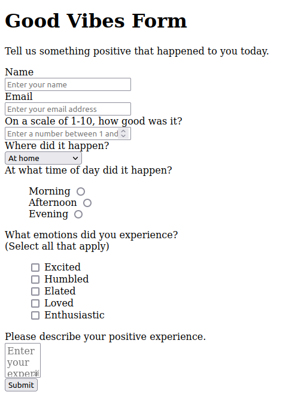

# cs50x_task_week8

Task resolution process:

- Fork the repo
- Clone the forked repo to your local machine
- Resolve the task
- Commit your solution
- Push to GitHub
- create a pull request

Task 1:

As you learn this week most of the HTML tags through our class you have a task to solve. 
You can choose one of the two tasks provided in detail.
This task solutions must be received before Monday 21:30, any solution after this time will be ignored.

Choose one of the following options:
1. Good vibes form: A form to submit good things that happen today. An example of the form can be found below this details.
2. Restaurant: A landing page similar to this site [here](https://jolly-kalam-23776e.netlify.app/restaurantwebsite/) (only HTML tags).
3. Make your own personal idea with a single page or multi page but you must use at least 10 different HTML body tags on a page. 

Good luck

